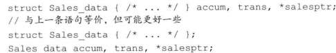

# C++ Primer Notes

----

[参考Github](https://github.com/setowenGit/Cpp_Primer_Practice/tree/master)

[参考知乎](https://zhuanlan.zhihu.com/p/454873031)

## Chapter 1

1. 函数包含四个部分：返回类型、函数名、形参列表和函数体

2. 内置类型（built-in type）：即语言自身定义的类型，如int、bool等

3. 一种类型不仅定义了数据元素的内容，还定义了这类数据上可以进行的运算

4. 标准输入输出流

* iostream库，包含两个基础类型istream和ostream
* 一个流就是一个字符序列，随着时间的推移，字符是顺序生成或消耗的
* 标准输入 cin
* 标注输出 cout
* 输出警告和错误信息 cerr
* 输出程序运行时的一般性信息 clog
* 操作符endl的效果是结束当前行，并将与设备关联的缓冲区中的内容刷到设备中。缓冲刷新操作可以保证到目前为止程序所产生的所有输出都真正写入输出流中，而不是仅仅停留在内容中等待写入流

5. 命名空间namespace（如std）可以帮助我们避免不经意的名字定义冲突，以及使用库中相同名字导致的冲突

6. 编译错误主要类型：语法错误、类型错误、声明错误

7. 比如一直cin的时候，我们想要结束文件输入，可以敲Ctrl+Z（这是输入文件结束符），再按Enter

8. 编辑-编译-调试（edit-compile-debug）周期

## Chapter 2

### 2.1 基本内置类型

C++定义了算术类型和空类型两种基本数据类型，空类型不对应具体的值

#### 2.1.1 算数类型

1. 算数类型包括整型和浮点型

2. 整型包括短整型short，整型int，长整型long和**long long（C++11新特性）**，布尔类型，字符类型

3. 字符类型包括普通的字符型char和扩展字符型（wchar_t，char16_t，char32_t，用于Unicode字符集服务）

4. 浮点型包括单精度float，双精度double，扩展精度long double。其中由于float的表示范围为 $-2^7-2^7$，故有效位为7个，由于double的表示范围为 $-2^{16}-2^{16}$，故有效位为16个。

5. 除去布尔类型和扩展字符型，其他整型都可划分为带符号的（signed）和无符号的（unsigned）。特殊的，字符型char分为了三种：char，signed char（用于存储-128到128区间的值），unsigned char（用于存储0到255区间的值），但需注意，char和signed char并不一样，char是有符号还是无符号取决于所使用的编译器。

6. 在算术表达式中不要使用char或bool，因为char某些编译器下有符号，而在另一些无符号，若直接进行运算很可能不符合编程者预期。若硬要使用，则需明确指出其类型（signed char或unsigned char）

7. 执行浮点数运算优先选择double，因为float精度不高且计算代价和double相差无几

8. 下图为C++标准规定的尺寸的最小值，同时允许编译器赋予它们更大的尺寸


#### 2.1.2 类型转换

1. 把一种算术类型的值赋给另外一种类型


> 对于将-1赋值给8bit大小的unsigned char，一种方法是求出-1的补码为[1111 1111]，故它在unsigned的十进制情况下值就是255
> 
> 另一种计算方法是unsigned char的最大值加上-1，也就是 $2^8-1=255$
> 
> 
2. 含有无符号类型的表达式

* 当一个算术表达式中既有unsigned又有int时，int就会转换成unsigned类型
* 当unsigned数减去一个值时，若计算结果为负值，则最终也得表示成unsigned型，也最终结果就是该负值的补码所对应的二进制值
  * 注意下面的是错误的，因为unsigned不可能小于0，故循环条件一直成立 
  * ``` for(unsigned u = 10; u >= 0; --u) ```
* 注意：非必要不要混用带符号类型和无符号类型

#### 2.1.3 字面值常量（也就是常量）

1. 整型字面值常量

* 整型字面值可写作十进制数、八进制数（以0开头，如024）、十六进制数（以0x或0X开头，如0x14）
* 十进制数字面值的类型是int、long和long long中能容纳下当前值的尺寸最小的那个
* 八进制数和十六进制数是int、unsigned int、long、unsigned long、long long和unsigned long long中能容纳下当前值的尺寸最小的那个
* 没有字面值表示为short类型
* 字面值常量没有负数，如-42虽有负号，但这个负号并不在字面值之内，它只是一个独立的运算符

2. 浮点型字面值

* 浮点型字面值都是double类型

3. 字符和字符串字面值

* 由单引号括起来的一个字符是char型字面值
* 双引号括起来的若干或0个字符是字符串型字面值
* 字符串字面值实际上是由常量字符构成的数组，但字符串结尾会添加一个空字符（'\0'），故实际长度比它的内容多1
  * 字符串操作中，size()=length()
  * sizeof()=size()+1，即包括'\0'。此函数是获取数据在内存中所占用的存储空间，并以字节为单位计数 

4. 转义序列

* 包括不可打印的字符和含有特殊含义的字符


* 泛化的转移序列：\x后跟1个或多个十六进制数字，\后跟1到3个八进制数字


5. 制定字面值的类型

* 字符和字符串字面值是用前缀，整型和浮点型字面值是用后缀


6. 布尔字面值是true和false

7. 指针字面值是**nullptr（C++11新特性）**

### 2.2 变量

变量提供一个具名的、可供程序操作的存储空间。

#### 2.2.1 变量定义

当对象在创建时获得了一个特定的值，这个对象就被**初始化**了

* 初始化不是赋值，初始化是创建变量时赋予其一个初始值，二赋值是把对象的当前值擦除，以一个新值来替代
* **C++11新特性**新加了用花括号来初始化变量，叫做列表初始化，若使用列表初始化且初始值存在丢失信息的风险，则编译器会报错，如下


* 下面的初始化方式等价


* 默认初始化是指定义变量时没有指定初值。定义于函数体内的内置类型的对象如果没有初始化，则其值未定义；类的对象如果没有显示地初始化，则其值由类确定。如下初始值分别为：""，0，未定义，""


#### 2.2.2 变量声明

由于C++支持分离式编译（程序可分割为若干文件，每个文件独立编译），所以一个文件可能需要另一个文件中定义的变量，此时在这个文件需要**声明**。```extern int i```

* 声明与定义的区别如下
  * 两者都规定了变量的类型和名字，但定义还申请了存储空间，也可能为变量赋了初始值
  * 任何包含了显式初始化的声明都是定义，这个也是定义```extern int i = 1;```
  * 变量只能定义一次，但可以被声明多次

#### 2.2.3 标识符

标识符也就是变量的名字，由字母、数字和下划线组成，有如下规范：

* 必须以字母或下划线开头
* 自定义的标识符不可出现连续两个下划线
* 自定义的标识符不可以下划线紧连大写字母开头
* 函数体外的标识符不可以下划线开头


#### 2.2.4 作用域

* 作用域以花括号分隔
* 名字的有效区域始于名字的声明语句，以声明语句所在的作用域末端结束
* 分为全局作用域和块作用域
* 也可分为内层作用域和外层作用域，这是嵌套的作用域。作用域中一旦声明了某个名字，它所嵌套者的作用域中都能够访问这个名字，同时，也允许在内层作用域中重新定义外层作用域已有的名字

### 2.3 复合类型

复合类型是指基于其他类型定义的类型，主要有引用和指针。

#### 2.3.1 引用

引用为对象起了另外一个名字，通过将声明符写成&的形式绑定对象。

```c++
int ival = 1;
int &refVal = ival;// refVal可认为是ival的另外一个名字
int &refVal2 = refVal;// 绑定到了refVal上，相当于绑定到了ival上
int i = 1, &r= i, r2 = i;// r绑定到了i上，r2是int，并且它的初始值是1
```

* 引用必须初始化，且无法重新绑定另外一个对象
* 定义了引用后，对其进行的所有操作都是在与之绑定的对象上进行的
* 由于引用本身不是对象，故不能定义引用的引用
* 引用只能绑定在对象上，而不能与字面值或某个表达式的计算结果绑定在一起（const的引用除外）
* 引用的类型都要和它所绑定的对象严格匹配（const的引用除外）

#### 2.3.2 指针

指针存放某个对象的**地址**，声明符为*

```c++
int ival = 42;
int *p = &ival;// p存放ival的地址，或者说p是指向ival的指针
*p = 1;// 解引用，并把p指向的ival的值改为1
int *p2;// 未初始化
p2 = p;// p2与p所指向的对象一样
int &r = *p;// 注意这并不是指向引用的指针，而是r绑定了p所指向的变量，即r绑定了ival
```

* 指针与引用的区别
  * 指针本身就是一个对象，而引用不是对象
  * 指针无须在定义时赋初值，当不初始化情况下其值为不确定，引用必须初始化
  * 指针可重新赋值让其指向其他对象，而引用无法绑定新的对象
* 指针的类型都要和它所指向的对象严格匹配（指向const的指针除外）
* 引用不是对象，没有实际地址，故不能定义指向引用的指针
* 使用*进行解引用，若给解引用的结果赋值，实际上就是给指针所指的对象赋值
* 下面是初始化空指针的三种方式
```c++
int *p1 = nullptr;// nullptr是C++11新特性
int *p2 = 0;
int *p3 = NULL;// NULL的值就是0，需#include <cstdlib>
```
* 给指针赋新值就是令它存放一个新的地址，从而执行一个新的对象
* 指针判断
  * 若两个指针存放的地址相同，则返回true，否则返回false
  * 任何非0（也就是非空指针）对应的条件值都是true
* void* 可存放任意对象的指针，如```void *pv = &ival;```。该指针可以与别的指针进行比较、输入或输出等，但不可以直接操作它所指向的对象（如改变对象的值）
* 尤为注意的是：有时候int*放在一起好像感觉int型指针是这条语句中所有变量共同的类型一样，其实星号只是修饰了距离它**最近**的那个变量而已，如下
```c++
int* pi, i, *p2, &r = i;// pi是int型指针，i是int型变量，p2是int型指针，r是引用
```
* 指针的指针
```c++
int ival = 1;
int *p = &ival;// p指向一个int型的变量
int **pp = &p;// pp指向一个int型的指针
cout << **pp;// 解引用也得两个*号，打印出1
```
* 指向指针的引用：当*&在一起时，得**从右往左**阅读，首先由于&号，r是一个引用，其次*表明r引用的是一个指针，最后int表明该指针指向一个int型变量
```c++
int i = 1;
int *p;
int *&r = p;// r绑定指针p
r = &i;// 等价于p = &i;
*r = 0;// 等价于*p = 0;
```

### 2.4 const限定符

const限定符为常量限定符，可以使变量的值不被改变

* 任何对const变量的赋值行为都将引发报错
* const对象必须初始化


* 编译器在编译过程中会把用到const变量的地方都替换成对应值
* const对象被定义为仅在文件内有效，当多个文件都出现了同名的const变量时，等同于不同文件分别定义了独立的变量；要使多个文件共享一个const变量，必须在const变量定义时添加extern关键词

#### 2.4.1 const的引用

把引用绑定到const对象上


* 之前说“引用的类型都要和它所绑定的对象严格匹配”，但const引用例外，在初始化const对象引用时允许用任意表达式作为初始值，下面都是合法的，其原理大概是引用实际上绑定的是需绑定对象的一个临时量对象，临时量对象就是一个对象，且里面可能做了转换类型的动作，故引用可绑定到这个对象上


* 常量引用仅对引用可参加的操作做出了限定，对于引用的对象本身是否是const变量未作限定；由于对象可能不是const型，所以允许通过其他途径改变它的值


#### 2.4.2 指针和const

##### 指向常量的指针

指针指向的对象时const对象

* 不能用于改变其所指对象的值
* 之前说“指针的类型都要和它所指向的对象严格匹配”，但指向常量的指针例外，在初始化指向常量的指针时没有规定其所指的对象必须是const型变量
* 仅对指针可参加的操作做出了限定，对于指针所指向的对象本身是否是const变量未作限定；由于对象可能不是const型，所以允许通过其他途径改变它的值


##### 常量指针

指针本身定为常量const

* 必须初始化
* 初始化后它的值（即存储的地址）将不能改变
* 从右往左读最下面的代码，首先const表明pip是个const型，接着*表明该const型是个const型指针，最后const double表明该const型指针指向的是一个const型double对象


#### 2.4.3 顶层const

* 对象本身是const型，那就是顶层const
* 复合类型对象（如引用和指针）所绑定或指向对象时const型，那就是底层const


#### 2.4.4 constexpr和常量表达式

常量表达式是指值不会改变并且在编译过程就能得到计算结果的表达式


由于数据类型只是int不是const int，所以staff_size不是常量表达式；由于get_size()函数要在运行时才能获得其值，所以sz不是常量表达式

* constexpr类型（**C++11新特性**）用来由编译器来验证变量的值是否是一个常量表达式，声明为constexpr的变量一定是一个常量，且必须用常量表达式初始化


* 声明constexpr用到的类型必须比较简单，这些类型称为字面值类型
  * 算数类型、引用和指针属于字面值类型，自定义类型、IO库、string类型不属于字面值类型
  * constexpr指针的初始值必须是nullptr或0，或者存储于某个固定地址中的对象

* constexpr仅对指针有效，与指针所指的对象无关


### 2.5 处理类型

#### 2.5.1 类型别名

使用typedef，或者using（**C++11新特性**）


* 注意下面的cstr，它并不是指向常量的指针，而是char型的常量指针。所以对于涉及到指针的类型别名，不能简单地把类型别名替换成它本来的样子，这样子可能会发生错误


#### 2.5.2 auto类型说明符

auto（**C++11新特性**）可让编译器通过初始值来推算变量的类型

* auto定义的变量必须有初始值
* auto开头的语句中所有变量的初始基本数据类型必须一样


* 初始值为引用时，编译器会将引用对象的类型作为auto的类型


* auto会忽略掉顶层const（对于指针来说就是指针肯定不是常量指针），保留底层const；若想定义顶层const，需明确指出


#### 2.5.3 decltype类型指示符

decltype（**C++11新特性**）选择并返回操作数的数据类型，编译器会分析表达式并得到其类型，但不实际计算表达式的值

* 与auto不同之处：decltype会保留顶层const和引用


* 若decltype使用的表达式不是一个变量，则返回表达式结果对应的类型


### 2.6 自定义数据结构

#### 2.6.1 struct类型

* struct内部定义的名字必须唯一，但可以与类外部定义的名字重复
* 类体右侧的表示结束的花括号后必须写一个分号
* 可以为数据成员提供一个类内初始值（**C++11新特性**），用于初始化数据成员，没有初始值的成员将被被默认初始化



#### 2.6.2 编写头文件

* 头文件通常包含那些只能被定义一次的实体，如类、const和constexpr
* 有时候头文件A会被头文件B包含，而头文件A和头文件B又被头文件C包含，此时头文件A被多次包含了
* 为了确保头文件多次包含仍能安全工作，引入预处理器技术
* 预处理功能：#include——预处理器会将指定的头文件内容代替#include
* 预处理功能：防止重复包含
  * #define 把一个名字设定为预处理变量
  * #ifdef 当且仅当预处理变量已定义时为真
  * #ifndef 当且仅当预处理变量未定义时为真
  * #endif 一旦检查结果为真，执行后续操作直至遇到该指令
  * 预处理变量的名字一般基于头文件中的类名字来构建，且为了避免与程序中的其他实体发生名字冲突，一般把预处理变量的名字全部大写


