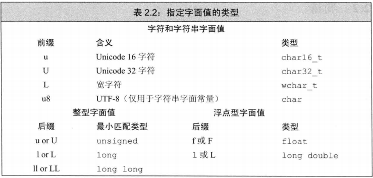
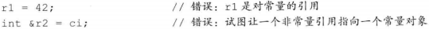
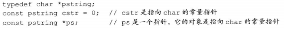
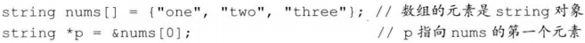
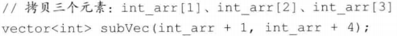

# C++ Primer Notes

----

[参考Github](https://github.com/setowenGit/Cpp_Primer_Practice/tree/master)

[参考知乎](https://zhuanlan.zhihu.com/p/454873031)

## 第1章 开始

1. 函数包含四个部分：返回类型、函数名、形参列表和函数体

2. 内置类型（built-in type）：即语言自身定义的类型，如int、bool等

3. 一种类型不仅定义了数据元素的内容，还定义了这类数据上可以进行的运算

4. 标准输入输出流

* iostream库，包含两个基础类型istream和ostream
* 一个流就是一个字符序列，随着时间的推移，字符是顺序生成或消耗的
* 标准输入 cin
* 标注输出 cout
* 输出警告和错误信息 cerr
* 输出程序运行时的一般性信息 clog
* 操作符endl的效果是结束当前行，并将与设备关联的缓冲区中的内容刷到设备中。缓冲刷新操作可以保证到目前为止程序所产生的所有输出都真正写入输出流中，而不是仅仅停留在内容中等待写入流

5. 命名空间namespace（如std）可以帮助我们避免不经意的名字定义冲突，以及使用库中相同名字导致的冲突

6. 编译错误主要类型：语法错误、类型错误、声明错误

7. 比如一直cin的时候，我们想要结束文件输入，可以敲Ctrl+Z（这是输入文件结束符），再按Enter

8. 编辑-编译-调试（edit-compile-debug）周期

## 第2章 变量和基本类型

### 2.1 基本内置类型

C++定义了算术类型和空类型两种基本数据类型，空类型不对应具体的值

#### 2.1.1 算数类型

1. 算数类型包括整型和浮点型

2. 整型包括短整型short，整型int，长整型long和**long long（C++11新特性）**，布尔类型，字符类型

3. 字符类型包括普通的字符型char和扩展字符型（wchar_t，char16_t，char32_t，用于Unicode字符集服务）

4. 浮点型包括单精度float，双精度double，扩展精度long double。其中由于float的表示范围为 $-2^7-2^7$，故有效位为7个，由于double的表示范围为 $-2^{16}-2^{16}$，故有效位为16个。

5. 除去布尔类型和扩展字符型，其他整型都可划分为带符号的（signed）和无符号的（unsigned）。特殊的，字符型char分为了三种：char，signed char（用于存储-128到128区间的值），unsigned char（用于存储0到255区间的值），但需注意，char和signed char并不一样，char是有符号还是无符号取决于所使用的编译器。

6. 在算术表达式中不要使用char或bool，因为char某些编译器下有符号，而在另一些无符号，若直接进行运算很可能不符合编程者预期。若硬要使用，则需明确指出其类型（signed char或unsigned char）

7. 执行浮点数运算优先选择double，因为float精度不高且计算代价和double相差无几

8. 下图为C++标准规定的尺寸的最小值，同时允许编译器赋予它们更大的尺寸


#### 2.1.2 类型转换

1. 把一种算术类型的值赋给另外一种类型


> 对于将-1赋值给8bit大小的unsigned char，一种方法是求出-1的补码为[1111 1111]，故它在unsigned的十进制情况下值就是255
> 
> 另一种计算方法是unsigned char的最大值加上-1，也就是 $2^8-1=255$
> 
> 
2. 含有无符号类型的表达式

* 当一个算术表达式中既有unsigned又有int时，int就会转换成unsigned类型
* 当unsigned数减去一个值时，若计算结果为负值，则最终也得表示成unsigned型，也最终结果就是该负值的补码所对应的二进制值
  * 注意下面的是错误的，因为unsigned不可能小于0，故循环条件一直成立 
  * ``` for(unsigned u = 10; u >= 0; --u) ```
* 注意：非必要不要混用带符号类型和无符号类型

#### 2.1.3 字面值常量（也就是常量）

1. 整型字面值常量

* 整型字面值可写作十进制数、八进制数（以0开头，如024）、十六进制数（以0x或0X开头，如0x14）
* 十进制数字面值的类型是int、long和long long中能容纳下当前值的尺寸最小的那个
* 八进制数和十六进制数是int、unsigned int、long、unsigned long、long long和unsigned long long中能容纳下当前值的尺寸最小的那个
* 没有字面值表示为short类型
* 字面值常量没有负数，如-42虽有负号，但这个负号并不在字面值之内，它只是一个独立的运算符

2. 浮点型字面值

* 浮点型字面值都是double类型

3. 字符和字符串字面值

* 由单引号括起来的一个字符是char型字面值
* 双引号括起来的若干或0个字符是字符串型字面值
* 字符串字面值实际上是由常量字符构成的数组，但字符串结尾会添加一个空字符（'\0'），故实际长度比它的内容多1
  * 字符串操作中，size()=length()
  * sizeof()=size()+1，即包括'\0'。此函数是获取数据在内存中所占用的存储空间，并以字节为单位计数 

4. 转义序列

* 包括不可打印的字符和含有特殊含义的字符


* 泛化的转移序列：\x后跟1个或多个十六进制数字，\后跟1到3个八进制数字


5. 制定字面值的类型

* 字符和字符串字面值是用前缀，整型和浮点型字面值是用后缀




6. 布尔字面值是true和false

7. 指针字面值是**nullptr（C++11新特性）**

### 2.2 变量

变量提供一个具名的、可供程序操作的存储空间。

#### 2.2.1 变量定义

当对象在创建时获得了一个特定的值，这个对象就被**初始化**了

* 初始化不是赋值，初始化是创建变量时赋予其一个初始值，二赋值是把对象的当前值擦除，以一个新值来替代
* **C++11新特性**新加了用花括号来初始化变量，叫做列表初始化，若使用列表初始化且初始值存在丢失信息的风险，则编译器会报错，如下


* 下面的初始化方式等价


* 默认初始化是指定义变量时没有指定初值。定义于函数体内的内置类型的对象如果没有初始化，则其值未定义；类的对象如果没有显示地初始化，则其值由类确定。如下初始值分别为：""，0，未定义，""


#### 2.2.2 变量声明

由于C++支持分离式编译（程序可分割为若干文件，每个文件独立编译），所以一个文件可能需要另一个文件中定义的变量，此时在这个文件需要**声明**。```extern int i```

* 声明与定义的区别如下
  * 两者都规定了变量的类型和名字，但定义还申请了存储空间，也可能为变量赋了初始值
  * 任何包含了显式初始化的声明都是定义，这个也是定义```extern int i = 1;```
  * 变量只能定义一次，但可以被声明多次

#### 2.2.3 标识符

标识符也就是变量的名字，由字母、数字和下划线组成，有如下规范：

* 必须以字母或下划线开头
* 自定义的标识符不可出现连续两个下划线
* 自定义的标识符不可以下划线紧连大写字母开头
* 函数体外的标识符不可以下划线开头


#### 2.2.4 作用域

* 作用域以花括号分隔
* 名字的有效区域始于名字的声明语句，以声明语句所在的作用域末端结束
* 分为全局作用域和块作用域
* 也可分为内层作用域和外层作用域，这是嵌套的作用域。作用域中一旦声明了某个名字，它所嵌套者的作用域中都能够访问这个名字，同时，也允许在内层作用域中重新定义外层作用域已有的名字

### 2.3 复合类型

复合类型是指基于其他类型定义的类型，主要有引用和指针。

#### 2.3.1 引用

引用为对象起了另外一个名字，通过将声明符写成&的形式绑定对象。

```c++
int ival = 1;
int &refVal = ival;// refVal可认为是ival的另外一个名字
int &refVal2 = refVal;// 绑定到了refVal上，相当于绑定到了ival上
int i = 1, &r= i, r2 = i;// r绑定到了i上，r2是int，并且它的初始值是1
```

* 引用必须初始化，且无法重新绑定另外一个对象
* 定义了引用后，对其进行的所有操作都是在与之绑定的对象上进行的
* 由于引用本身不是对象，故不能定义引用的引用
* 引用只能绑定在对象上，而不能与字面值或某个表达式的计算结果绑定在一起（const的引用除外）
* 引用的类型都要和它所绑定的对象严格匹配（const的引用除外）

#### 2.3.2 指针

指针存放某个对象的**地址**，声明符为*

```c++
int ival = 42;
int *p = &ival;// p存放ival的地址，或者说p是指向ival的指针
*p = 1;// 解引用，并把p指向的ival的值改为1
int *p2;// 未初始化
p2 = p;// p2与p所指向的对象一样
int &r = *p;// 注意这并不是指向引用的指针，而是r绑定了p所指向的变量，即r绑定了ival
```

* 指针与引用的区别
  * 指针本身就是一个对象，而引用不是对象
  * 指针无须在定义时赋初值，当不初始化情况下其值为不确定，引用必须初始化
  * 指针可重新赋值让其指向其他对象，而引用无法绑定新的对象
* 指针的类型都要和它所指向的对象严格匹配（指向const的指针除外）
* 引用不是对象，没有实际地址，故不能定义指向引用的指针
* 使用*进行解引用，若给解引用的结果赋值，实际上就是给指针所指的对象赋值
* 下面是初始化空指针的三种方式，允许给空指针加上或减去一个值为0的整型常量表达式，两个空指针也允许彼此相减，结果为0
```c++
int *p1 = nullptr;// nullptr是C++11新特性
int *p2 = 0;
int *p3 = NULL;// NULL的值就是0，需#include <cstdlib>
```
* 给指针赋新值就是令它存放一个新的地址，从而执行一个新的对象
* 指针判断
  * 若两个指针存放的地址相同，则返回true，否则返回false
  * 任何非0（也就是非空指针）对应的条件值都是true
* void* 可存放任意对象的指针，如```void *pv = &ival;```。该指针可以与别的指针进行比较、输入或输出等，但不可以直接操作它所指向的对象（如改变对象的值）
* 尤为注意的是：有时候int*放在一起好像感觉int型指针是这条语句中所有变量共同的类型一样，其实星号只是修饰了距离它**最近**的那个变量而已，如下
```c++
int* pi, i, *p2, &r = i;// pi是int型指针，i是int型变量，p2是int型指针，r是引用
```
* 指针的指针
```c++
int ival = 1;
int *p = &ival;// p指向一个int型的变量
int **pp = &p;// pp指向一个int型的指针
cout << **pp;// 解引用也得两个*号，打印出1
```
* 指向指针的引用：当*&在一起时，得**从右往左**阅读，首先由于&号，r是一个引用，其次*表明r引用的是一个指针，最后int表明该指针指向一个int型变量
```c++
int i = 1;
int *p;
int *&r = p;// r绑定指针p
r = &i;// 等价于p = &i;
*r = 0;// 等价于*p = 0;
```

### 2.4 const限定符

const限定符为常量限定符，可以使变量的值不被改变

* 任何对const变量的赋值行为都将引发报错
* const对象必须初始化


* 编译器在编译过程中会把用到const变量的地方都替换成对应值
* const对象被定义为仅在文件内有效，当多个文件都出现了同名的const变量时，等同于不同文件分别定义了独立的变量；要使多个文件共享一个const变量，必须在const变量定义时添加extern关键词

#### 2.4.1 const的引用

把引用绑定到const对象上




* 之前说“引用的类型都要和它所绑定的对象严格匹配”，但const引用例外，在初始化const对象引用时允许用任意表达式作为初始值，下面都是合法的，其原理大概是引用实际上绑定的是需绑定对象的一个临时量对象，临时量对象就是一个对象，且里面可能做了转换类型的动作，故引用可绑定到这个对象上


* 常量引用仅对引用可参加的操作做出了限定，对于引用的对象本身是否是const变量未作限定；由于对象可能不是const型，所以允许通过其他途径改变它的值


#### 2.4.2 指针和const

##### 指向常量的指针

指针指向的对象时const对象

* 不能用于改变其所指对象的值
* 之前说“指针的类型都要和它所指向的对象严格匹配”，但指向常量的指针例外，在初始化指向常量的指针时没有规定其所指的对象必须是const型变量
* 仅对指针可参加的操作做出了限定，对于指针所指向的对象本身是否是const变量未作限定；由于对象可能不是const型，所以允许通过其他途径改变它的值


##### 常量指针

指针本身定为常量const

* 必须初始化
* 初始化后它的值（即存储的地址）将不能改变
* 从右往左读最下面的代码，首先const表明pip是个const型，接着*表明该const型是个const型指针，最后const double表明该const型指针指向的是一个const型double对象


#### 2.4.3 顶层const

* 对象本身是const型，那就是顶层const
* 复合类型对象（如引用和指针）所绑定或指向对象时const型，那就是底层const


#### 2.4.4 constexpr和常量表达式

常量表达式是指值不会改变并且在编译过程就能得到计算结果的表达式


由于数据类型只是int不是const int，所以staff_size不是常量表达式；由于get_size()函数要在运行时才能获得其值，所以sz不是常量表达式

* constexpr类型（**C++11新特性**）用来由编译器来验证变量的值是否是一个常量表达式，声明为constexpr的变量一定是一个常量，且必须用常量表达式初始化


* 声明constexpr用到的类型必须比较简单，这些类型称为字面值类型
  * 算数类型、引用和指针属于字面值类型，自定义类型、IO库、string类型不属于字面值类型
  * constexpr指针的初始值必须是nullptr或0，或者存储于某个固定地址中的对象

* constexpr仅对指针有效，与指针所指的对象无关


### 2.5 处理类型

#### 2.5.1 类型别名

使用typedef，或者using（**C++11新特性**）


* 注意下面的cstr，它并不是指向常量的指针，而是char型的常量指针。所以对于涉及到指针的类型别名，不能简单地把类型别名替换成它本来的样子，这样子可能会发生错误



#### 2.5.2 auto类型说明符

auto（**C++11新特性**）可让编译器通过初始值来推算变量的类型

* auto定义的变量必须有初始值
* auto开头的语句中所有变量的初始基本数据类型必须一样


* 初始值为引用时，编译器会将引用对象的类型作为auto的类型


* auto会忽略掉顶层const（对于指针来说就是指针肯定不是常量指针），保留底层const；若想定义顶层const，需明确指出


#### 2.5.3 decltype类型指示符

decltype（**C++11新特性**）选择并返回操作数的数据类型，编译器会分析表达式并得到其类型，但不实际计算表达式的值

* 与auto不同之处：decltype会保留顶层const和引用


* 若decltype使用的表达式不是一个变量，则返回表达式结果对应的类型


### 2.6 自定义数据结构

#### 2.6.1 struct类型

* struct内部定义的名字必须唯一，但可以与类外部定义的名字重复
* 类体右侧的表示结束的花括号后必须写一个分号
* 可以为数据成员提供一个类内初始值（**C++11新特性**），用于初始化数据成员，没有初始值的成员将被被默认初始化


#### 2.6.2 编写头文件

* 头文件通常包含那些只能被定义一次的实体，如类、const和constexpr
* 有时候头文件A会被头文件B包含，而头文件A和头文件B又被头文件C包含，此时头文件A被多次包含了
* 为了确保头文件多次包含仍能安全工作，引入预处理器技术
* 预处理功能：#include——预处理器会将指定的头文件内容代替#include
* 预处理功能：防止重复包含
  * #define 把一个名字设定为预处理变量
  * #ifdef 当且仅当预处理变量已定义时为真
  * #ifndef 当且仅当预处理变量未定义时为真
  * #endif 一旦检查结果为真，执行后续操作直至遇到该指令
  * 预处理变量的名字一般基于头文件中的类名字来构建，且为了避免与程序中的其他实体发生名字冲突，一般把预处理变量的名字全部大写


上述这种编写头文件代码的习惯建议养成

## 第3章 字符串、向量和数组

### 3.1 命名空间的using声明

使用```using namespace::name;```，之后就可以直接访问命名空间中的名字

位于头文件的代码一般来说不应该使用using声明

### 3.2 标准库类型string

#### 3.2.1 定义和初始化string对象

初始化的方式有以下几种：


* 拷贝初始化：使用等号（=）初始化一个变量；直接初始化：不适用等号


#### 3.2.2 string对象上的操作

主要有以下几种：


* 读写string对象：使用cin读string对象的内容时，string对象会被自动忽略开头的**空白（包括空格符、换行符、制表符等）**，并从第一个真正的字符开始读起，如string对象为```string s = "   Hello World  ;"```，但cin读取后cout出来的只是```"Hello"```
* 读取未知数量的string对象：可使用```while(cin >> word)```，它代表如果流有效，也就是说没遇到文件结束标记或非法输入，那么执行while语句内部的操作
* 使用getline读取一整行：如果希望最终输出的字符串保留输入时的空白符，可用getline函数代替>>运算符，getline遇到换行符才结束读取操作
* string::size_type类型：实际上，```s.size()```函数返回的字符个数虽然是一个无符号类型整型数，但它的类型不是unsigned int，更不是int，而是string::size_type类型
  *  一条表达式如果有了size()就不要和int混合使用了，避免带来运算问题，因为size()返回的毕竟是unsigned类型
  *  像我们编程习惯地写```int i = 0; s[i] = "a";```这样的，其实是 i 作为索引时编译器自动将其由int类型转为size_type类型表达的无符号类型，所以无需类型转换的方式是这么写```decltype(s.size()) i = 0; s[i] = "a";```
* 比较string对象


* 字面值和string对象相加：当把string对象和字符字面值及字符串字面值混在一条语句中使用时，必须确保每个加法运算符的两侧的运算对象至少有一个是string
  *  需注意的是：为了兼容C，C++中的字符串字面值并不是标准库类型string的对象


#### 3.2.3 处理string对象中的字符

cctype头文件中的函数：


* 使用范围for遍历字符串中每个字符：使用**范围for（range for，C++11新特性）**，下面就是通过auto让编译器决定变量c的类型，这里c的类型是char，每次迭代，s的下一个字符被拷贝给c


* 使用范围for改变字符串中的字符：若是要改变而不是单纯遍历，则必须**把循环变量定义为引用类型**，此时赋值给c也就是改变s中对应字符的值


* 使用下标执行字符串迭代：下面的例子可看出index的类型是由decltype关键字决定的，即定义为string::size_type类型


### 3.3 标准库类型vector

vector是模板而非类型

C++有类模板和函数模板，而vector就是属于类模板。编译器根据模板创建类或函数的过程为实例化，当使用模板时，需要在尖括号<>中向编译器指出应把类或函数实例化为何种类型。

#### 3.3.1 定义和初始化vector对象


* 其中使用花括号的是之前就提过的**列表初始化（C++11新特性）**
* 可认为使用小括号的是用来构造vector对象的，使用花括号的是尽可能把花括号内的值当成是元素初始值，如下为一些例子


#### 3.3.2 vector操作


* 使用范围for循环时，循环体内部不可包含有向vector对象添加元素的语句，如push_back()函数
* 使用size()函数返回的返回值类型是由vector定义的size_type类型，且该类型必须指出vector中存储的元素的类型


* vector对象的下标运算符可用于访问已存在的元素，而不能用于添加元素；通过下标访问不存在的元素，会出现 **缓冲区溢出(buffer overflow)** 错误

### 3.4 迭代器

有效的迭代器或者指向某个元素，或者指向容器中尾元素的下一个位置；其他情况都属于无效

#### 3.4.1 使用迭代器

* begin成员负责返回指向第一个元素的迭代器
* end成员负责返回指向容器尾元素的下一个位置的迭代器
* 若容器为空，则begin和end返回的是同一个迭代
* 下面是标准迭代器的运算符


* 迭代器拥有两种类型：iterator和const_iterator。如果vector对象是一个常量，只能使用const_iterator；如果vector对象不是常量，那么两种迭代器类型都可以使用


* begin和end返回的迭代器具体类型由对象是否是常量决定，如果对象时常量，begin和end返回const_iterator；如果对象不是常量，返回iterator

```c++
const vector<int> cv;
auto it = cv.begin(); // it的类型是vector<int>::const_iterator
```

* 为了便于专门得到const_iterator类型的返回值，**C++11引入了两个新函数：cbegin和cend**，如

```c++
auto it = v.cbegin(); // it的类型是vector<int>::const_iterator
```

* 任何一种可能改变vector对象容量的操作，比如push_back，都会使该vector对象的迭代器失效

#### 3.4.2 迭代器运算


* 需注意的是，减号运算符得到的两个迭代器的距离，其类型是名为difference_type的带符号整型数

### 3.5 数组

与vector不同，数组的大小确定不变，不能随意向数组中增加元素，不允许直接拷贝和赋值，但运行性能在某些情况下较好

#### 3.5.1 定义和初始化内置数组

* 数组初始化时指定的维度必须是一个常量表达式，且默认情况下，数组的元素会被默认初始化


* 显示初始化时，可采用列表初始化。如果维度比提供的初始值数量大，则用提供的初始值初始化靠前的元素，剩下的元素初始化成默认值


* 对于字符数组的初始化，还可以使用字符串字面值对此进行初始化


* 数需要注意的是，数组不允许直接拷贝和赋值从而完成初始化


* 允许定义数组的指针及数组的引用，但不存在存储引用的数组（因为引用不是对象）
  *  其中第一个是一个**指针数组**，第三个是一个**数组指针** 


#### 3.5.2 访问数组元素

在cstddef头文件中定义了size_t类型，用于使用数组下标，该类型实际是一种无符号类型

使用范围for来遍历数组元素


#### 3.5.3 指针和数组

指针和数组联系密切

* 对数组的元素使用取地址符就能得到指向该元素的指针



* 编译器会自动将数组名字替换为一个指向数组首元素的指针，使用数组类型的对象其实是使用一个指向该数组元素的指针


* 当使用数组作为一个auto变量的初始值时，会推断得到的类型是指针而非数组；但使用decltype关键字时上述转换不会发生


* 允许使用递增运算符将指向数组元素的指针向前移动到下一个位置上


##### 标准库函数begin和end

可使用下面方法遍历数组，但该方法极易出错

```c++
int *e = &arr[10]; // 指向arr尾元素的下一个位置的指针
for(int *b = arr; b != e; ++b){
  cout << *b << endl;
}
```

引入iterator头文件中的begin函数和end函数（**C++11新特性**），更加简单安全

```c++
int ia[] = {0,1,2,3,4,5,6,7,8,9};
int *beg = begin(ia); // 指向ia首元素的指针
int *last = end(ia); // 指向arr尾元素的下一个位置的指针
```

##### 指针运算

迭代器的所有运算方式，数组的指针都可以使用

数组中两个指针相减的结果是它们之间的距离，参与运算的两个指针必须指向同一个数组当中的元素。n的类型是cstddef头文件中的ptrdiff_t类型，实际上它是带符号的类型


只要两个指针指向同一个数组的元素，或是指向该数组的尾元素的下一个位置，就能利用关系运算负对其进行比较

##### 解引用和指针运算的交互

指针加上一个整数所得到的结果还是一个指针，假设结果指针指向了一个元素，则允许解引用该结果指针


标准库类型限定使用的下标必须是无符号类型，而内置的下标运算无此要求，内置的下标运算可以处理负数，但结果地址必须指向原来的指针所指同一数组中的元素


#### 3.5.4 C风格字符串

C风格字符串不是一种类型，字符串存放在字符数组中并以**空字符（'\0'）**结束，一般利用指针来操作这个字符串

cstring头文件中定义了用于操作C风格字符串的函数，传入此类函数的指针必须指向以空字符作为结束的字符数组


比较下面两种定义方式，第一种是不以空字符结束的，而第二种会自动加上空字符，只有第二种才是C风格字符串

```c++
char ca[] = {'C','+','+'}; // 不是C风格字符串
char cal[] = "C++"; // C风格字符串
```
下面的练习答案为：会将ca字符数组打印出来，但是因为没有空字符的存在，程序不会退出循环


#### 3.5.5 与旧代码的接口

由于C++不得不与那些充满了数组和C风格字符串的代码衔接，为了简单易行，C++专门提供了一组功能

##### 混用string对象和C风格字符串


利用c_str函数（返回值为C风格的字符串），使用string对象初始化指向字符的指针，其中s为string类型字符串


##### 使用数组初始化vector对象


用于初始化vector对象的值也可能仅是数组的一部分



### 3.6 多维数组

严格来说，C++语言没有多维数组，通常所说的多维数组其实是数组的数组

##### 多维数组的初始化


##### for遍历多维数组

* 如果表达式含有的下标运算符数量和数组的维度一样多，该表达式的结果将是给定类型的元素
* 如果表达式含有的下标运算符数量比数组的维度小，该表达式的结果将是给定索引处的一个内层数组

普通两层for遍历：


范围for遍历：

* row的类型是含有4个整数的数组的引用
* col的类型是整数的引用
* 将外层循环的控制变量声明为引用类型，是必须的，这是为了**避免数组被自动转成指针**
* 假设不用引用，编译器初始化row时会自动将这些数组形式的元素（**和其他类型的数组一样**），转换成指向该数组首元素的指针，此时row的类型是int *，这样内层的循环就不合法了
* 因此，为了保险起见，使用范围for一般都加上引用


##### 指针和多维数组

当程序使用多维数组的名字时，会自动将其转换成指向数组首元素的指针，该指针实际上指向第一个内层数组的指针

（1）直接声明指针类型


（2）使用auto避免在数组前面加上指针类型，p指向ia的第一个内层数组，那么*p是一个含有4个整数的数组，而q也用了auto，那么```auto q = *p```就相当于q是一个指向内层数组首元素的指针（**仔细看看，有点难理解**）


（3）使用begin和end函数避免在数组前面加上指针类型


（4）使用类型别名简化多维数组的指针，在这里将类型“4个整数组成的数组”命名为int_array


重要练习：


练习3.43

```c++
#include <iostream>
using std::cout; using std::endl;

int main()
{
    int arr[3][4] = 
    { 
        { 0, 1, 2, 3 },
        { 4, 5, 6, 7 },
        { 8, 9, 10, 11 }
    };

    // range for
    for (int(&row)[4] : arr)
        for (int col : row) cout << col << " ";
    cout << endl;

    // for loop
    for (size_t i = 0; i != 3; ++i)
        for (size_t j = 0; j != 4; ++j) cout << arr[i][j] << " ";
    cout << endl;

    // using pointers.
    for (int(*row)[4] = arr; row != arr + 3; ++row)
        for (int *col = *row; col != *row + 4; ++col) cout << *col << " ";
    cout << endl;

    return 0;
}
```

练习3.44

```c++
// a range for to manage the iteration
// use type alias
using int_array = int[4];
for (int_array& p : ia)
    for (int q : p)
        cout << q << " ";
cout << endl;

// ordinary for loop using subscripts
for (size_t i = 0; i != 3; ++i)
    for (size_t j = 0; j != 4; ++j)
        cout << ia[i][j] << " ";
cout << endl;

// using pointers.
// use type alias
for (int_array* p = ia; p != ia + 3; ++p)
    for (int *q = *p; q != *p + 4; ++q)
        cout << *q << " ";
cout << endl;
```

练习3.45

```c++
// a range for to manage the iteration
for (auto& p : ia)
    for (int q : p)
        cout << q << " ";
cout << endl;

// ordinary for loop using subscripts
for (size_t i = 0; i != 3; ++i)
    for (size_t j = 0; j != 4; ++j)
        cout << ia[i][j] << " ";
cout << endl;

// using pointers.
for (auto p = ia; p != ia + 3; ++p)
    for (int *q = *p; q != *p + 4; ++q)
        cout << *q << " ";
cout << endl;
```

## 第4章 表达式

### 4.1 基础

* 使用重载运算符时，其包括运算对象的类型和返回值的类型，都是由该运算符定义的；但是运算对象的个数、运算符的优先级和结合律都是无法改变的
* 左值(lvalue)和右值(rvalue)：当一个对象被用作右值的时候，用的是对象的值（内容），当对象被用作左值的时候，用的是对象的身份（在内存中的位置） 


* 算术运算符的左结合律：如果运算符的优先级相同，将按照从左向右的顺序组合运算对象
* 括号无视普通的组合规则
* 有4种运算符明确规定了运算对象的求值顺序
  *  &&: 先求左侧运算对象的值，只有当左侧为真时才继续求右侧
  *  ||
  *  ?:
  *  ,
* 拿不准的时候最好用括号强制让表达式的组合关系符合程序逻辑的要求
* 如果改变了某个对象的值，在表达式的其他地方不要再使用这个运算对象

### 4.2 算术运算符


* 参与取余运算的运算对象必须是整数类型
* **C++11新特性**规定商一律向0取整，即直接切除小数部分

### 4.3 逻辑和关系运算符


* 逻辑运算符作用于任意能转换成布尔值的类型
* 逻辑运算符和关系运算符的返回值都是布尔类型
* 短路求值


* 关系运算符都满足左结合律
* 注意一下两个相等性比较：对于第二种情况 （1）当布尔值转换成其他算术类型时，false转换成0，true转换成1；（2）如果val不是布尔值，那么进行比较之前会首先把true转换成val的类型


### 4.4 赋值运算符

* 赋值运算符的左侧运算对象必须是一个可修改的左值
* 如果赋值运算符的左右两个运算对象类型不同，则右侧运算对象将转换成左侧运算对象的类型
* **C++11新特性**允许使用花括号括起来的初始值列表作为赋值语句的右侧运算对象
  * 如果左侧运算对象是内置类型，那么初始值列表最多只能包含有一个值，而且该值即使转换的话其所占空间也不应该大于目标类型的空间
  * 对于类类型来说，赋值运算的细节由类本身决定
  * 无论左侧运算对象的类型是什么，初始值列表都可以为空，此时编译器创建一个值初始化的临时量并将其赋给左侧运算对象
  * 如下，其中k为int类型


* 赋值运算符满足右结合律
* 对于多重赋值语句中的每一个对象，它的类型或者与右边对象的类型相同、或者可由右边对象的类型转换得到


* 赋值运算的优先级相对较低
* 切勿混淆相等运算符和赋值运算符，如 ```if(i = j)``` ，if语句的条件部分把j的值赋给i，然后检查赋值的结果是否为真，如果j不为0，则条件为真

* 复合赋值运算符


### 4.5 递增和递减运算符

前置版本：先加1（或减1），然后将改变后的对象作为求值结果

后置版本：将运算对象加1（或减1），但求值结果是运算对象改变之前那个值的副本

* 如 ```*pbeg++```，后置递增运算符的优先级高于解引用运算符，因此其等价于 ```*(pbeg++)```，pbeg先加1，然后返回pbeg的初始值的副本作为其求值结果，此时解引用运算符的运算对象是pbeg未增加之前的值


* 除非必须，否则不用递增递减运算符的后置版本
* 一条表达式不要出现多个递增递减运算符，如 ```*beg = toupper(*beg++);```，该赋值语句是未定义的

### 4.6 成员访问运算符

表达式 ```ptr->mem``` 等价于 ```(*ptr).mem```

解引用运算符的优先级低于点运算符，所以执行解引用运算的子表达式两端必须加上括号

箭头运算符作用于一个指针类型的运算对象，结果是一个左值；点运算符分为两种情况：（1）如果成员所属的对象是左值，那么结果是左值，若是右值，则结果是右值

### 4.7 条件运算符

```cond ? expr1 : expr2;```

条件运算符的优先级非常低，因此当一条长表达式中嵌套了条件运算子表达式时，通常需要在它两端加上括号


上述第二条表达式等价于


上述第三条表达式等价于


### 4.8 位运算符

位运算符作用于整数类型的运算对象，并把运算对象看成是二进制位的集合

关于符号位如何处理没有明确的规定，故强烈建议仅将位运算符用于处理无符号类型


##### 移位运算符

左移运算符(<<)在右侧插入值为0的二进制位

右移运算符(>>)的行为依赖于其左侧运算对象的类型

* 如果该运算对象是无符号类型，在左侧插入值为0的二进制位
* 如果该运算对象是带符号类型，在左侧插入符号位的副本或值为0的二进制位

##### 位与、位或、位异或


##### 位运算符常规使用

* 对单个位赋1 ```quiz1 |= 1UL << 27;```
* 对单个位赋0 ```quiz1 &= ~(1UL << 27);```
* 查询单个位 ```bool status = quiz1 & (1UL << 27)```

### 4.9 sizeof 运算符

sizeof 运算符返回一条表达式或一个类型名字所占的字节数，其所得值的类型是size_t

* 有两种形式: (1)```sizeof (tye)```; (2)```sizeof expr```，在第二种形式中，sizeof 返回的是表达式结果类型的大小
* sizeof 并不实际计算其运算对象的值
* **C++11新特性**允许我们使用作用域运算符来获取类成员的大小
* sizeof 运算符无须我们提供一个具体的对象，如```sizeof(int32_t)```也可以


如对vector类型使用sizeof，由于vector固定的部分是下面这三个指针，所以sizeof返回的是$3*8$，即3个指针，每个指针占8个字节


### 4.10 逗号运算符

按照从左到右的顺序依次求值，首先对左侧的表达式求值，然后将求值结果丢弃掉，真正的结果是右侧表达式的值，如果右侧运算对象是左值，那么最终的求值结果也是左值，如

```c++
int count = 1;
int var = (count++, count+100, 99+count);
```

最后结果是101，也就是(1+1)+99

### 4.11 类型转换

如果两种类型可以相互转换，那么它们就是关联的

两个不同类型的值不会直接相加，而是先根据类型转换规则设法将运算对象的类型统一后再求值，这是一种**隐式转换**

以下面为例

```c++
int ival = 3.541 + 3;
```

* 算术类型之间的隐式转换设计得尽可能避免损失精度，如整型会转换成浮点型再和浮点型相加，在这里是3转换为3.000
* 被初始化的对象的类型无法改变，所在这里运算结果6.541会转换成与ival的类型相同的类型，也就是转换成int型的6

何时发生隐式类型转换


#### 算术转换

* 运算符的运算对象将转换成**最宽**的类型，如一个运算对象的类型是long double，那么其他运算对象也转换成long double
* 当表达式中既有浮点类型也有整数类型时，整数值将转换成相应的浮点类型

##### (1) 整型提升

指把小整数类型转换成较大的整数类型

1. 对于bool, char, signed char, unsigned char, short 和 unsigned short等类型来说，只要它们所有可能的值都能存在int里，它们就会被提升成int类型，否则提升为unsigned int类型
2. 较大的char类型（wchar_t, char16_t, char32_t）提升成int, unsigned int, long, unsigned long, long long, unsigned long long中最小的一种类型，且转换后的类型能容纳类型所有可能的值

##### (2) 无符号类型的运算对象

当某个运算对象是无符号类型时，首先进行整型提升（注意下方的大和小指的是类型的所占内存大小）

1. 如果运算对象的提升结果匹配，则无须下一步转换
2. 如果提升后的运算对象的类型都是带符号或是无符号的，则小类型的运算对象转换成较大的类型
3. 如果一个是无符号类型，一个是带符号类型，而且其中的无符号类型不小于带符号类型，则带符号的运算对象转换成无符号的，如unsigned int和int的两个运算对象，int类型的运算对象将转换成unsigned int类型
4. 如果一个是无符号类型，一个是带符号类型，而且其中的无符号类型小于带符号类型，若无符号类型的所有值都可以存在该该带符号类型中，则无符号的运算对象转为该带符号类型，否则带符号的运算对象转为该无符号类型

一些算术转换例子：


#### 其他隐式类型转换

##### (1) 数组转换成指针

在大多数用到数组的表达式中，数组自动转换成指向数组首元素的指针


当数组被用作decltype关键字的参数，或者作为取地址符(&)，sizeof及typeid等运算符的运算对象时，上述转换不会发生；同样的，如果用一个引用来初始化数组，上述转换也不会发生

##### (2) 指针的转换

* 常量整数值0或者字面值nullptr能转换成任意指针类型
* 指向任意非常量的指针能转换成void *
* 指向任意对象的指针能转换成const void *

##### (3) 转换成布尔类型

如果指针或算术类型的值为0，转换结果是fasle，否则转换结果是true

##### (4) 转换成常量

如果T是一种类型，我们就能将指向T的指针或引用分别转换成指向const T的指针或引用


##### (5) 类类型定义的转换


