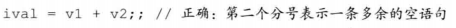
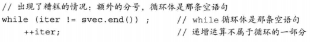
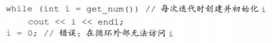
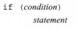
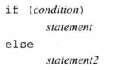
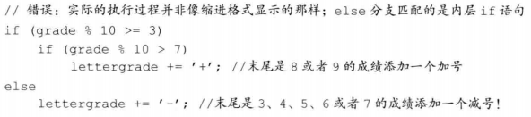
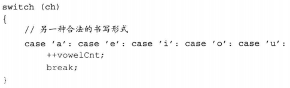
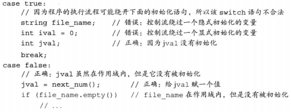
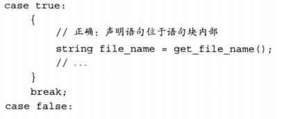
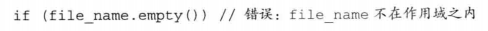

# C++ Primer Notes 2

----

[参考Github](https://github.com/setowenGit/Cpp_Primer_Practice/tree/master)

[参考知乎](https://zhuanlan.zhihu.com/p/454873031)

## 第5章 语句

* 表达式语句的作用是执行表达式**并丢弃掉求值结果**
* 空语句中只含有一个单独的分号，如果在程序的某个地方，语法上需要一条语句但是逻辑上不需要，此时应该使用空语句
* 别漏写分号，也别多写分号

* 复合语句指用花括号括起来的（可能为空的）语句和声明的序列，复合语句也被称为块，**一个块就是一个作用域**，在块中引入的名字只能在块内部以及嵌套在块中的字块里访问
  * 名字在有限的区域内可见，该区域从名字定义出开始，到名字所在的（最内层）块的结尾为止
  * 块不以分号作为结束，而是指内部没有任何语句的一对花括号，空块的作用等价于空语句

* 语句作用域：可在if，switch，while和for语句的控制结构内定义变量，定义在控制结构内的变量只在相应语句的内部可见，一旦语句结束，变量也就超出其作用范围了

### 5.1 条件语句

#### if

形式如下：

其中condition里的表达式或是变量都将转换成布尔型

悬垂else问题：规定else与离它最近的尚未匹配的if匹配，如下面例子的else分支其实是内层if语句的一部分

#### switch

* switch表达式的值将转换成整数类型，然后与每个case标签的值比较
* 如果表达式和某个case标签的值匹配成功，程序从该标签之后的第一条语句开始执行，直到达到了switch的结尾或者是遇到一条break语句为止
* case标签必须是整型常量表达式
* 任何两个case标签的值不能相同，否则会引发错误
* default也是一种特殊的case标签
* 有时候希望两个或更多个值共享同一组操作，此时可以故意省略掉break语句，使得程序能够连续执行若干个case标签

* 如果在某处一个带有初值的变量位于作用域之外，在另一处该变量位于作用域之内，则从前一处跳转到后一处的行为是非法行为

* 如果需要为某个case分支定义并初始化一个变量，应该把变量定义在块内，从而确保后面的所有case标签都在变量的作用域之外

