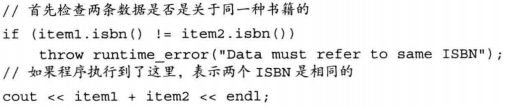

# C++ Primer Notes 2

----

[参考Github](https://github.com/setowenGit/Cpp_Primer_Practice/tree/master)

[参考知乎](https://zhuanlan.zhihu.com/p/454873031)

## 第5章 语句

* 表达式语句的作用是执行表达式**并丢弃掉求值结果**
* 空语句中只含有一个单独的分号，如果在程序的某个地方，语法上需要一条语句但是逻辑上不需要，此时应该使用空语句
* 别漏写分号，也别多写分号


* 复合语句指用花括号括起来的（可能为空的）语句和声明的序列，复合语句也被称为块，**一个块就是一个作用域**，在块中引入的名字只能在块内部以及嵌套在块中的字块里访问
  * 名字在有限的区域内可见，该区域从名字定义出开始，到名字所在的（最内层）块的结尾为止
  * 块不以分号作为结束，而是指内部没有任何语句的一对花括号，空块的作用等价于空语句

* 语句作用域：可在if，switch，while和for语句的控制结构内定义变量，定义在控制结构内的变量只在相应语句的内部可见，一旦语句结束，变量也就超出其作用范围了


### 5.1 条件语句

#### if

形式如下：


其中condition里的表达式或是变量都将转换成布尔型

悬垂else问题：规定else与离它最近的尚未匹配的if匹配，如下面例子的else分支其实是内层if语句的一部分


#### switch

* switch表达式的值将转换成整数类型，然后与每个case标签的值比较
* 如果表达式和某个case标签的值匹配成功，程序从该标签之后的第一条语句开始执行，直到达到了switch的结尾或者是遇到一条break语句为止
* case标签必须是整型常量表达式
* 任何两个case标签的值不能相同，否则会引发错误
* default也是一种特殊的case标签
* 有时候希望两个或更多个值共享同一组操作，此时可以故意省略掉break语句，使得程序能够连续执行若干个case标签


* 如果在某处一个带有初值的变量位于作用域之外，在另一处该变量位于作用域之内，则从前一处跳转到后一处的行为是非法行为


* 如果需要为某个case分支定义并初始化一个变量，应该把变量定义在块内，从而确保后面的所有case标签都在变量的作用域之外


### 5.2 迭代语句

#### while

定义在while条件部分或者while循环体内的变量每次迭代都经历从创建到销毁的过程

#### for

形式如下


* 牢记for语句投中的定义的对象只在for循环体内可见
* init-statement也可以定义多个对象，但是只能有一条声明语句，因此，所有变量的基础类型必须相同，如下面在init-statement里同时定义了索引i和循环控制变量sz，它们类型相同


* for语句头能省略掉init-statement，condition和expression中的任意个
  * 若无需初始化，则可省略掉init-statement
  * 省略掉condition的效果等价于在条件部分写了一个true
  * 省略掉expression必须要在条件部分或者循环体部分改变迭代变量的值

**C++11**引入了范围for，形式如下


* expression表示的必须是一个序列，比如用花括号括起来的初始值列表、数组或者vector或string等类型的对象，这些类型的共同特点是拥有能返回迭代器的begin和end成员
* declaration定义一个变量，序列中的每个元素都得能转换成该变量的类型
* 确保类型相容最简单的方法是使用auto类型说明符
* 如果需要对序列中的元素执行写操作，循环变量必须声明成引用类型
* 每次迭代都会重新定义循环控制变量，并将其初始化成序列中的下一个值，之后才会执行statement
* 强调不能通过范围for语句增加vector对象，因为在范围for语句中预存了end()的值，一旦序列中添加（删除）元素，end函数的值就可能变得无效了

#### do while

形式如下


* 容易忘记的是：while后要加分号
* condition不能为空，且其使用的变量必须定义在循环体之外

### 5.3 跳转语句

#### break

* break语句终止离它最近的while、do while、for或switch语句，并从这些语句之后的第一条语句开始继续执行
* break语句只能出现在迭代语句或者switch语句内部

#### continue

* continue语句终止最近的循环中的当前迭代并立即开始下一次迭代
* continue语句只能出现在for、while和do while循环的内部
* continue语句中断当前的迭代，但是仍然继续执行循环
  * 对于while或do while，继续判断条件的值
  * 对于传统for，继续执行for语句头expression
  * 对于范围for，用序列中的下一个元素初始化循环控制变量

#### goto

goto语句无条件跳转到同一函数内的另一条语句，形式如下


例子如下


### 5.4 异常处理

异常是指存在于运行时的反常行为，这些行为超出了函数正常功能的范围，典型的异常包括失去数据库连接以及遇到意外输入等

#### throw

例子如下



该异常是类型runtime_error的对象，抛出异常将终止当前的函数，并把控制权转移给能处理该异常的代码

runtime_error是标准异常类型的一种，定义在stdexcept头文件中，初始化runtime_error的对象，方式是给它提供一个string对象或者一个C风格的字符串，这个字符串包含关于异常的辅助信息

#### try

形式如下


catch子句包含三大部分：关键字catch、括号内一个（可能未命名的）对象的声明（即异常声明）、一个块

当选中了某个catch子句处理异常之后，执行与之对应的块。catch一旦完成，程序跳转到try语句块最后一个catch子句之后的那条语句继续执行

与上面throw中的例子连起来看，则


其中```err.what()```输出上面例子runtime_error中的字符串

如果上节编写的代码抛出异常，则本节的catch子句输出，其中上节的代码与这节的代码可能是不同线程的，本节的代码是与用户交互的代码


* 一个try语句可能调用了包含另一个try语句块的函数，新的try语句块可能调用了包含了有一个try语句块的新函数，因此当异常抛出时，会沿着程序的执行路径逐层回退，逐层往外搜catch，直到找到适当类型的catch子句为止
* 如果最终还是没找到任何匹配的catch子句，程序会转到名为```terminate```的标准库函数，该函数的行为与系统有关，一般情况下，执行该函数将导致程序非正常退出

导致对象处于无效或未完成的状态，或者资源没有正常释放，那些在异常发生期间正确执行了“清理”工作的程序称为异常安全

#### 标准异常

用于报告标准库函数遇到的问题


* 我们只能以默认初始化的方式初始化exception、bad_alloc和bad_cast对象，不允许为这些对象提供初始值
* 其他异常类型的行为恰好相反，应该使用string对象或者C风格字符串初始化这些类型的对象，但不允许使用默认初始化的方式


